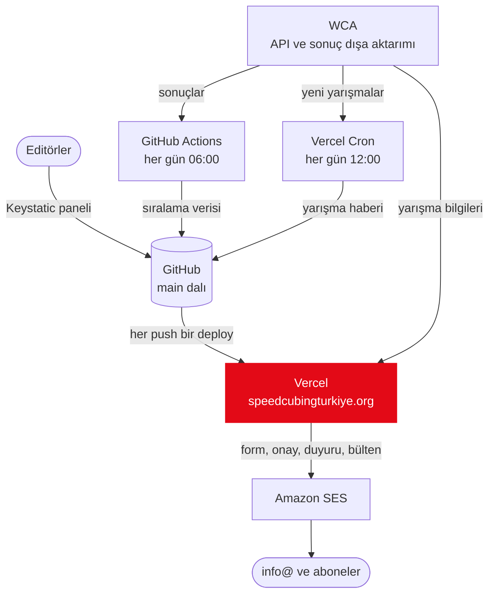

<p align="center">
  <a href="https://speedcubingturkiye.org">
    <picture>
      <source media="(prefers-color-scheme: dark)" srcset="public/brand/logo-long-inverted.svg">
      
    </picture>
  </a>
</p>

<p align="center">
  Türkiye'deki WCA yarışmaları, ulusal sıralamalar ve speedcubing topluluğu için site.<br>
  <a href="https://speedcubingturkiye.org"><b>speedcubingturkiye.org</b></a>
</p>

## Neler var

- Yarışma takvimi ve yarışma sayfaları: kayıt durumu, kontenjan, yer ve WCA Live bağlantısı.
- 17 etkinlikte eksiksiz Türkiye sıralamaları. Her sabah güncellenir.
- İlk kez yarışacaklar ve veliler için rehberler, sık sorulan sorular.
- Haberler ve RSS. Türkiye'de yeni bir yarışma açılınca duyurusu otomatik yazılır.
- Çift onaylı e-posta bülteni.
- Organizasyon sayfaları: tüzük, belgeler, ilanlar, gönüllülük, güvenli ortam.
- Türkçe ve İngilizce, açık ve koyu tema. Metinler tarayıcıdan, görsel editörle düzenlenir.

## Nasıl çalışır



Sitenin veritabanı yok. Sayfalar, haberler ve ayarlar bu repodaki dosyalardır. Panelden yapılan her kayıt `main`'e bir commit olur ve her push Vercel'de yeni bir deploy başlatır. Yarışmalar WCA API'den okunup önbelleğe alınır. Sıralamalar her sabah WCA'nın sonuç dışa aktarımından yeniden üretilir. Bülten aboneleri Amazon SES'in kişi listesinde durur.

Türkçe sayfalar kökte, İngilizceler `/en` altında. Site Next.js 16 (App Router), TypeScript, Tailwind CSS 4, next-intl, MDX ve Keystatic ile yazıldı. Şemadaki saatler Türkiye saatidir.

## Başlarken

Node 24 ve pnpm 11 ile çalışır.

```bash
pnpm install
cp .env.example .env.local
pnpm dev
```

Site `http://localhost:3000` adresinde açılır. Anahtar girmeden de çalışır. O zaman mailler gönderilmez, konsola yazılır. Görsel editör `http://localhost:3000/keystatic` adresinde: yerelde giriş istemez, dosyaları doğrudan diskte düzenler.

| Komut | Ne yapar |
|---|---|
| `pnpm dev` | Geliştirme sunucusu |
| `pnpm build` | İçerik kontrolü, ardından production build |
| `pnpm start` | Build'i sunar |
| `pnpm lint` | ESLint |
| `pnpm typecheck` | TypeScript kontrolü |
| `pnpm test` | Vitest testleri |
| `pnpm tsx scripts/check-content.ts` | Sadece içerik kontrolü |
| `pnpm data:rankings` | Sıralama verisini WCA'dan yeniden üretir |
| `pnpm og` | Paylaşım görselini (`public/og.png`) logodan üretir |
| `MSYS_NO_PATHCONV=1 powershell -ExecutionPolicy Bypass -File scripts/smoke.ps1 -Paths /,/en` | Build'i 3010 portunda açar, sayfaların HTTP kodlarını yazar, kapatır (Windows, Git Bash) |

## Ayrıntılar

<details>
<summary><b>İçerik</b></summary>

Sayfalar ve haberler repodaki MDX dosyalarıdır. Her sayfanın iki dili de olmak zorunda, biri eksikse build durur.

```text
content/tr/pages/<slug>.mdx     sayfa (Türkçe)
content/en/pages/<slug>.mdx     aynı sayfa (İngilizce)
content/news/<slug>/index.yaml  haber bilgileri: iki dilde başlık ve özet, tarih, kategori
content/news/<slug>/tr.mdx      haber metni (Türkçe)
content/news/<slug>/en.mdx      haber metni (İngilizce)
content/home/slides.json        ana sayfa slaytları, iki dil bir arada
```

Dosya yolu adresi belirler: `content/tr/pages/yarismalar/sss.mdx`, `/yarismalar/sss` ve `/en/yarismalar/sss` olur. Adlarda yalnız küçük harf, rakam ve tire kullanılır, Türkçe karakter kullanılmaz. Cron da WCA kimliğini küçük harfe çevirir: `yarisma-newageturkey2026`.

#### Sayfa eklemek

1. İki dosyayı da oluştur: `content/tr/pages/<slug>.mdx` ve `content/en/pages/<slug>.mdx`.

   ```mdx
   ---
   title: "Sayfa başlığı"
   description: "Arama motorları ve sayfa üstü için tek cümle"
   updated: "2026-09-25"
   ---

   Metin buraya. Başlık için `##`, liste için `-`, tablo için GFM tablosu.
   ```

2. Rotayı ekle: `app/[locale]/kvkk/page.tsx` dosyasını `app/[locale]/<slug>/page.tsx` olarak kopyala ve `SLUG` sabitini değiştir. Sayfa `/yarismalar/*` ya da `/organizasyon/*` altındaysa yan menülü (`SectionNav`) bir örneği kopyala.
3. Gerekirse `components/Footer.tsx` ve `app/sitemap.ts` dosyalarına bağlantı ekle.

#### Haber eklemek

En kolayı panel: `/keystatic`, sonra Haberler ([editör rehberi](docs/editor-kullanim.md)). Elle eklemek için `content/news/<slug>/` klasörünü aç ve `index.yaml` yaz:

```yaml
title: "Başlık (TR)"
titleEn: "Title (EN)"
description: "Listede görünen özet"
descriptionEn: "Summary shown in the list"
date: 2026-10-01
category: yarisma
auto: false
bulten: false
```

`tr.mdx` ve `en.mdx` yalnız metni içerir, başlarında ön bilgi (frontmatter) olmaz.

- `category`: `yarisma`, `topluluk`, `rekor` ya da `ilan`. İlanlar `/organizasyon/ilanlar` sayfasında da listelenir.
- `auto: true` yalnız cron'un yazdığı duyurularda olur ve "otomatik" rozeti gösterir.
- Rota gerekmez. Haber `/haberler/<slug>` adresinde ve RSS'te (`/haberler/rss.xml`, `/en/haberler/rss.xml`) otomatik yayımlanır.

#### Ana sayfa slaytları

`content/home/slides.json` panelin yazdığı biçimde tek bir dosya: `{ "slides": [ ... ] }`. İki tür öğe var.

`{ "discriminant": "static", "value": { ... } }` elle yazılan slayttır. Alanları:

- `id`: küçük harf, rakam ve tire, benzersiz
- `titleTr`, `titleEn`: en fazla 40 karakter
- `leadTr`, `leadEn`: en fazla 160 karakter
- `actions`: 1 ya da 2 düğme (`labelTr`, `labelEn`, `href`, `variant: "solid" | "outline"`)
- isteğe bağlı: `image` (`/images/slides/...`), `layout` (`mark | A | D | E | G | J`, varsayılan `mark`), `focus` (`center | top | bottom | left | right`), `altTr`, `altEn`. `mark` dışındaki yerleşimler fotoğraf ister.

`{ "discriminant": "next-competition" }` sıradaki yarışmayı WCA verisinden doldurur. Yaklaşan yarışma yoksa görünmez. En fazla bir tane olabilir.

`href` ya öneksiz bir site yolu olur (`/en` otomatik eklenir) ya da `https://` ile başlayan tam adres. Tam adresler yeni sekmede açılır. Hatalı bir alan build'i dosya adı ve slayt numarasıyla durdurur (`lib/slides.ts`). Yerleşimlerin nasıl göründüğü [editör rehberinde](docs/editor-kullanim.md).

#### MDX bileşenleri

Panel ham HTML tanımaz. Bu yüzden MDX'te yalnız şu bileşenler kullanılır:

| Bileşen | Ne işe yarar |
|---|---|
| `<Details summary="Soru?">…</Details>` | Açılır SSS maddesi. İçerikle etiketler arasında boş satır bırak. |
| `<Callout title="Başlık" lang="en">…</Callout>` | Vurgulu not kutusu. `title` ve `lang` isteğe bağlı, `lang` yalnız kutu sayfanın dilinden farklıysa gerekir. |
| `<DataController field="name" />`, `field="email"` | Site ayarlarındaki KVKK veri sorumlusu |
| `<MdxLink href="/kvkk" locale="tr">metin</MdxLink>` | Öbür dildeki bir sayfaya bağlantı |
| `<Anchor id="bulten" />` | Başlığın hemen üstüne konan sayfa içi hedef (`/kvkk#bulten`) |
| `<Lang code="en">Speedcubing</Lang>` | Büyük harfli bir başlıkta öbür dilden bir kelime (İ/I kuralı) |

İç bağlantıları iki dilde de öneksiz yaz: `[SSS](/yarismalar/sss)`. `/en` otomatik eklenir, dış bağlantılar yeni sekmede açılır. Metinde `<` ya da `{` gerekiyorsa başına ters eğik çizgi koy: `\<`, `\{`. Çıplak hallerini MDX etiket ya da kod sanır.

#### İçerik kontrolü

`pnpm build` önce `scripts/check-content.ts` betiğini çalıştırır. Bir hata bulursa build durur, canlı site son sağlam haliyle kalır. Hata mesajları Türkçedir ve dosyayla alanı gösterir.

Kontrol edilenler:

- Her sayfanın iki dili de var.
- Sayfalar, haberler, slaytlar, arayüz metinleri, site ayarları ve galeri panelin şemasına (`keystatic.config.ts`) uyuyor.
- Her haberde iki dilde metin ve geçerli bir tarih var.
- MDX'te yalnız yukarıdaki bileşenler var, ham HTML ya da kaçışsız `{` yok.
- Slaytlar `lib/slides.ts` kurallarına uyuyor.
- `messages/tr.json` ve `messages/en.json` aynı anahtarlara ve aynı yer tutuculara sahip.
- Adı geçen her görsel ve belge gerçekten var, görseller 5 MB'ı geçmiyor.

#### Panel commit'leri

Canlıdaki panel her kaydı `main`'e `chore(content): update <yol>` mesajıyla commit'ler, silmede `chore(content): delete <yol>` yazar. Bu biçim `patches/@keystatic__core@0.6.9.patch` yamasından gelir. Keystatic'i yükseltirken yamayı yeni sürüm için yenile: `pnpm patch @keystatic/core@<sürüm>`.

</details>

<details>
<summary><b>Yapılandırma ve ortam değişkenleri</b></summary>

`site.config.ts` site adını, adresini ve iletişim adresini tutar. Panelden düzenlenen ayarlar ise şu dosyalarda:

- `content/site.json`: KVKK veri sorumlusu, sosyal kanallar (boş kanal sitede görünmez), yönetim listesi (`board`, `boardUpdatedAt`) ve `/organizasyon/belgeler` sayfasındaki belgeler
- `content/gallery.json`: `/medya` galerisi
- `messages/tr.json`, `messages/en.json`: arayüz metinleri

Ortam değişkenlerinin listesi `.env.example` dosyasında. Vercel'de hepsi Production'a tanımlı, `CONTACT_EMAIL` ve `MAIL_FROM` Preview'a da.

| Değişken | Ne için |
|---|---|
| `SES_ACCESS_KEY_ID`, `SES_SECRET_ACCESS_KEY` | Amazon SES anahtarı. IAM kullanıcısı (`speedcubingturkiye-web-ses`) yalnız `news@` adına gönderebilir ve yalnız `bulten` listesine erişir. |
| `NEWSLETTER_SECRET` | Onay ve çıkış bağlantılarını şifreleyen anahtar, en az 32 karakter. Değişirse eski maillerdeki çıkış bağlantıları çalışmaz. |
| `BULTEN_SECRET` | `/api/bulten/gonder` rotasının anahtarı. GitHub'da yalnız `bulten` ortamında durur. |
| `BULTEN_KAPALI` | `1` ise elle bülten gönderimi kapanır. Değişiklik yeni deploy'la geçerli olur. |
| `CONTACT_EMAIL` | Form mesajlarının gittiği adres (`info@speedcubingturkiye.org`) |
| `MAIL_FROM` | Gönderen adres (`news@speedcubingturkiye.org`) |
| `CRON_SECRET` | `/api/cron/wca-check` rotasının anahtarı |
| `GITHUB_TOKEN`, `GITHUB_REPO` | Cron'un haber commit'lemesi için yalnız bu repoya yazabilen fine-grained token ve `owner/repo` |
| `NEXT_PUBLIC_KEYSTATIC_REPO` | Panelin commit attığı repo (`owner/repo`) |
| `KEYSTATIC_GITHUB_CLIENT_ID`, `KEYSTATIC_GITHUB_CLIENT_SECRET`, `KEYSTATIC_SECRET`, `NEXT_PUBLIC_KEYSTATIC_GITHUB_APP_SLUG` | Panelin GitHub App bağlantısı. Değerleri Keystatic'in kurulum sihirbazı verir. |

Yerelde:

- SES anahtarı yoksa mailler gönderilmez, onay bağlantısıyla birlikte konsola yazılır.
- `NEWSLETTER_SECRET` yoksa geliştirmeye özel sabit bir anahtar kullanılır.
- `next dev` abonelere hiçbir zaman toplu mail atmaz. Cron hep kuru çalışır (commit, mail ve silme yok), elle bülten rotası 503 döner.
- `.env.local` dosyasında SES anahtarları varsa form, onay ve çıkış gerçek listeye yazar.

</details>

<details>
<summary><b>E-posta ve bülten</b></summary>

Bütün mailler Amazon SES'ten (`us-east-1`) `news@speedcubingturkiye.org` adresinden gider. Maillerde takip pikseli yok, başka sunucudan görsel yüklenmez.

- **İletişim ve gönüllü formu:** Mesaj `info@` adresine gider. Konu `Speedcubing Türkiye: <konu>`, gönderen adı `<ad soyad> (form)` olur. "Yanıtla" formu dolduran kişiye yazar.
- **Bülten kaydı:** Form kişiyi SES'teki `bulten` listesine onay bekleyen olarak yazar ve formun dilinde onay maili yollar. Aynı adrese 24 saatte en fazla bir onay maili gider. Onay bağlantısı (`/bulten/onay`) 7 gün geçerlidir ve kişiyi kendi dilinin konusuna (`tr` ya da `en`) abone eder. Onaylanmayan adresleri cron 7 gün sonra siler.
- **Çıkış:** Her mailin altındaki bağlantı `/bulten/cikis` sayfasını açar. Gmail ve Apple Mail'in "Abonelikten çık" düğmesi `/api/bulten/cikis` üzerinden tek tıkla çıkarır. Bağlantılardaki token AES-256-GCM ile şifrelidir, adres linkte görünmez.
- **Otomatik duyuru:** Cron yeni yarışmanın haberini commit'ledikten sonra onaylı abonelere kendi dillerinde gönderir, Türkçe kopyasını da `info@` adresine yollar.
- **Elle bülten:** Panelde bir haberin "Bültenle gönder" kutusunu işaretleyip kaydet. `.github/workflows/bulten.yml` haberin dosyalarından bir özet (SHA-256) çıkarır, sitenin o hali yayına girene kadar bekler ve sonra `bulten` ortamında onay ister. Önizleme `/bulten/onizleme/<slug>` adresinde. Onaylanınca `/api/bulten/gonder` çağrılır. Haber bu arada değiştiyse gönderim reddedilir (409 `changed`) ve yeni hali tekrar onaya düşer. Gönderilen bültenler `content/newsletter-log.json` dosyasına yazılır: aynı haber iki kez gitmez, günde en fazla bir bülten gider. `BULTEN_KAPALI=1` gönderimi durdurur.

Onay adımı, panelden gelen bültenler için ikinci bir göz. Repoya push edebilen biri (çalınmış bir panel token'ı da) Production anahtarlarıyla her şeyi yapabilir. Bu yüzden yazma yetkisini dar tut ([yayın kontrol listesi](docs/yayin-kontrol-listesi.md), §3).

Gönderim hızı saniyede en fazla 10 mail. Bir gönderim Vercel'in 300 saniyelik sınırına sığmak zorunda. En kötü durumda bu, yaklaşık 850 mail demek. Abone sayısı 800'e yaklaşınca gönderimi bölmek gerekecek. Aynı gün açılan birkaç yarışmanın duyuruları aynı 300 saniyeyi paylaşır ve yarıda kalan gönderim yeniden denenmez.

</details>

<details>
<summary><b>Sıralama verisi</b></summary>

`/siralamalar` sayfaları veriyi repodaki `data/rankings/` klasöründen okur:

- `meta.json`: dışa aktarımın tarihi ve format sürümü
- etkinlik ve tür başına bir dosya, örneğin `single/333.json`. Her satır `[ulusal sıra, WCA ID, isim, sonuç]`.

Türkiye'yi temsil etmiş herkes listededir. Sayfada 25, 50, 100 ya da 500 satır gösterilir, "Sıramı bul" isimle ya da WCA ID ile arar.

`pnpm data:rankings` WCA'nın resmi sonuç dışa aktarımına (Results Export v2, TSV) bakar. Yeni bir dışa aktarım varsa zip'i (yaklaşık 378 MB) indirir, yalnız `results` ve `persons` tablolarını açar ve dosyaları yazar. Tarih aynıysa bir şey yapmaz.

- Sıralama kuralı WCA'nın ulusal sıralamasıyla aynı. Türkiye'yi temsil ederken alınan sonuçlar sayılır. Vatandaşlığını sonradan değiştiren biri, Türkiye dönemindeki sonuçlarıyla listede kalır. Herkesin etkinlik başına en iyi tekli ve ortalaması alınır, eşit sonuçlar aynı sırayı paylaşır.
- Seçenekler: `--force` (tarih aynı olsa da işle), `--from-dir <klasör>` (indirmeden, açılmış bir dışa aktarımı kullan), `--out <klasör>` (başka bir klasöre yaz).
- Betik şu durumlarda hiçbir dosyaya dokunmadan hata verir: format sürümü 2 değilse, bir tablo ya da sütun eksikse ya da 100 ve üzeri satırlı bir sıralama %10'dan fazla küçülürse.
- `.github/workflows/daily-data.yml` aynı komutu her gün 06:00'da (Türkiye saati) çalıştırır. Veri değiştiyse `main`'e `chore(data): update daily data - YYYY-MM-DD` commit'i atar, bu da normal bir deploy başlatır. Actions sekmesindeki "Run workflow" ile elle de çalışır.

</details>

<details>
<summary><b>Marka dosyaları</b></summary>

`public/brand/` klasöründe:

- `logo-long.svg`, `logo-long.png`: yatay logo
- `logo-mark.svg`, `logo-mark.png`: yalnız işaret
- `logo-long-inverted.svg`, `logo-mark-inverted.svg`: koyu zemin için
- `logo-mail.png`: maillerdeki logo

Kaynak: marka kiti (brand-identity.pdf v1.0). Renkler `app/globals.css` dosyasında tanımlı: kırmızı `#E30A17`, siyah `#1A1A1A`. Kullanım kuralları sitenin `/medya` sayfasında. Paylaşım görseli `public/og.png`, `pnpm og` ile üretilir.

Diğer statik dosyalar:

- `public/docs/`: tüzük PDF'leri (`tuzuk-tr.pdf`, `tuzuk-en.pdf`). Yüklenince `/organizasyon/tuzuk` sayfasındaki bağlantılar otomatik açılır.
- `public/galeri/`: galeri fotoğrafları. Panelin Galeri bölümünden yüklenir ve `content/gallery.json` dosyasına yazılır. Alt yazı ve açıklama isteğe bağlı. Liste boşken yer tutucu kareler görünür.
- `public/images/news/`, `public/images/slides/`: haber ve slayt fotoğrafları, panelden yüklenir.

</details>

<details>
<summary><b>Yayın</b></summary>

- `main`'e her push Vercel'de production deploy'u, her pull request bir preview başlatır. Ayrı bir CI yok, kapı görevini build görür: içerik kontrolü ve TypeScript.
- Alan adları Vercel'de. Asıl adres `speedcubingturkiye.org`. `www` ve `speedcubingturkiye.com` ona 308 ile yönlenir.
- GitHub Actions'ta iki iş var: günlük sıralama verisi ve onaylanan bültenlerin gönderimi.
- Cron (`vercel.json`) her gün 12:00'de (Türkiye saati) `/api/cron/wca-check` rotasını çağırır. Yeni WCA yarışmalarını haber olarak commit'ler, abonelere duyurur ve 7 günü geçmiş onaysız adresleri siler. Hobby planda cron günde bir kez çalışabiliyor.

Cron'u yerelde kuru çalıştırmak için:

```bash
curl -H "Authorization: Bearer $CRON_SECRET" "http://localhost:3000/api/cron/wca-check?dry=1"
```

</details>

## Belgeler

- [Editör rehberi](docs/editor-kullanim.md): panelle içerik düzenleme
- [Yayın kontrol listesi](docs/yayin-kontrol-listesi.md): kurulum adımları ve canlı testler
- [Değişiklik günlüğü](CHANGELOG.md)
